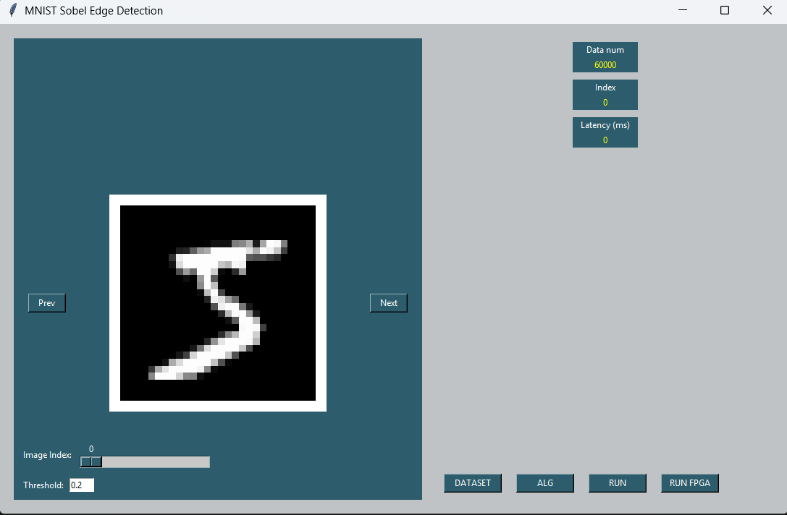

# 🚀 FPGA-Based Sobel Edge Detection on MNIST

This project demonstrates a complete **hardware-software co-design** flow for implementing a **Sobel edge detection filter** on an FPGA using the **MNIST dataset** of handwritten digits.

By leveraging the **Xilinx  Zynq-7000 SoC (ZedBoard)** platform, this work combines Python prototyping, High-Level Synthesis (HLS) in C++, and GUI development to accelerate image preprocessing using reconfigurable hardware.

---

## 📌 Table of Contents
- [🧠 Project Overview](#-project-overview)
- [🧪 Methodology](#-methodology)
- [📦 Features](#-features)
- [🔬 Technologies Used](#-technologies-used)
- [🖥️ GUI Overview](#-gui-overview)
- [⚙️ How to Run](#-how-to-run)

---

## 🧠 Project Overview

The project implements a **Sobel edge detection algorithm** for preprocessing grayscale images on an **FPGA**, optimized for **low latency** and **high throughput**. The algorithm is tested on the **MNIST** dataset and accelerated using:
- High-Level Synthesis (HLS) for hardware implementation
- Vivado for system integration
- Vitis for software development and co-simulation
- UART for communication with the PC
- A user-friendly **Python GUI** for interactive visualization

---

## 🧪 Methodology

### 1. 🧪 **Python Prototyping**
- Implemented Sobel filter using NumPy + SciPy
- Verified edge detection on MNIST digit images

### 2. ⚙️ **High-Level Synthesis (HLS)**
- Converted algorithm to C++
- Applied FPGA optimizations:
  - Loop pipelining
  - Loop unrolling
  - Bit-width reduction (fixed-point)
  - Array partitioning & dataflow

### 3. 🛠️ **Hardware Integration (Vivado)**
- Imported the HLS-generated IP into Vivado
- Designed Zynq-based system with AXI interconnects
- Enabled DDR and UART communication

### 4. 💻 **Software Integration (Vitis)**
- Developed host code for the ARM processor (PS)
- Transferred data via UART, controlled the Sobel accelerator
- Retrieved and returned results to GUI

### 5. 🖼️ **GUI Development (Tkinter + Matplotlib)**
- Load and preview MNIST images
- Adjust Sobel threshold
- Visualize original vs. edge-detected image

---

## 📦 Features

✅ Real-time edge detection on FPGA  
✅ HLS-optimized Sobel filter  
✅ PC-FPGA communication via UART  
✅ Interactive Python GUI  
✅ Based on open-source MNIST dataset  
✅ System-level integration using Vivado + Vitis  

---

## 🔬 Technologies Used

| Tool/Library         | Purpose                          |
|----------------------|----------------------------------|
| Python (NumPy, SciPy)| Algorithm prototyping            |
| Matplotlib, Tkinter  | GUI & Visualization              |
| C++ / Vitis HLS      | Hardware description (Sobel)     |
| Xilinx Vivado        | FPGA block design & synthesis    |
| Vitis IDE            | Host code development            |
| UART                 | PC ↔ FPGA communication          |
| Zynq ZedBoard        | Target FPGA hardware             |

---

## 🖥️ GUI Overview

- Choose a digit image from MNIST
- Set edge detection threshold
- Run FPGA processing
- View results (gradient X, Y, and magnitude)



---

## ⚙️ How to Run

### 💾 Prerequisites:
- Setup the dataset path in the GUI app
- Setup the dataset path in test bench file for vitis HLS simulation
- Vivado + Vitis installed
- Python ≥ 3.7 with required packages:
```bash
pip install numpy scipy pandas matplotlib pyserial
s
